# iRace

**iRace** is an invite-only fitness challenge app powered by Strava: create a goal, share a link, and race your crew on real activities. It is not affiliated with Strava.

---

## Screenshots

Captures below live in [`docs/strava-submission-screenshots/`](docs/strava-submission-screenshots/) (same set used for Strava API review). Production deploy example: [iraceapp.vercel.app](https://iraceapp.vercel.app).

### Landing and home

| Landing page | Signed in |
| --- | --- |
| 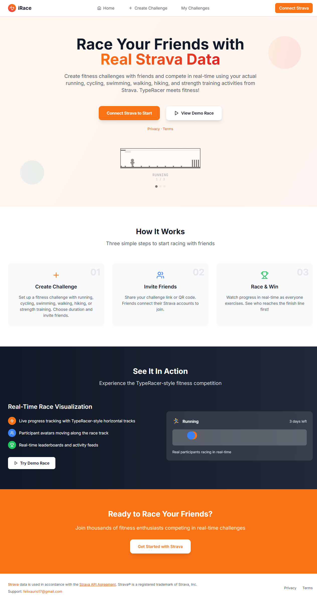 | 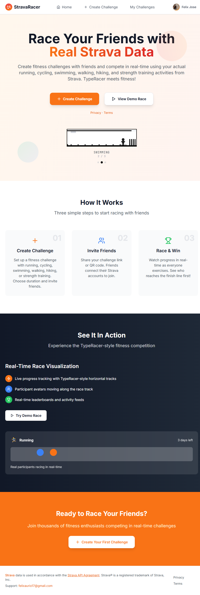 |

### Challenges: create, join, race

| Creator consent (step 2) | Join + participant consent |
| --- | --- |
| 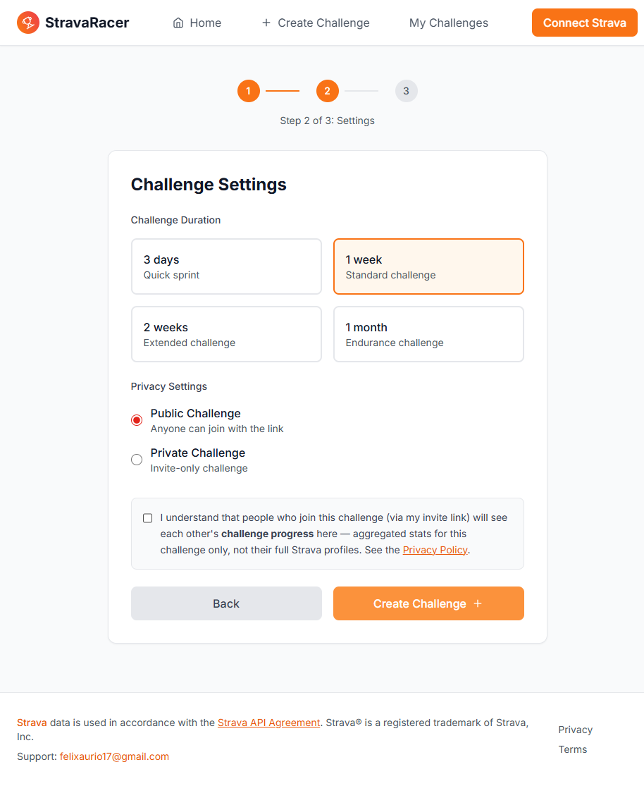 | 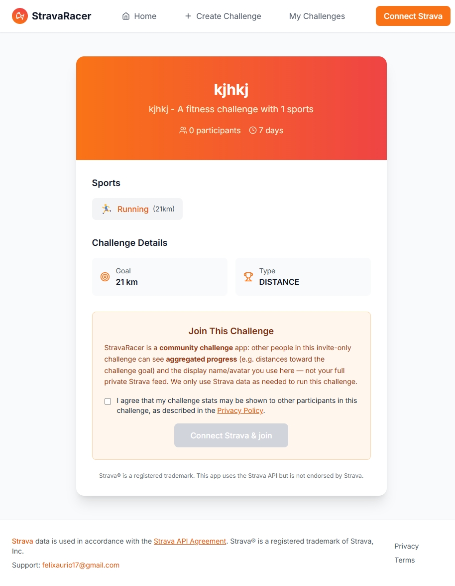 |

| Demo race / leaderboard |
| --- |
| 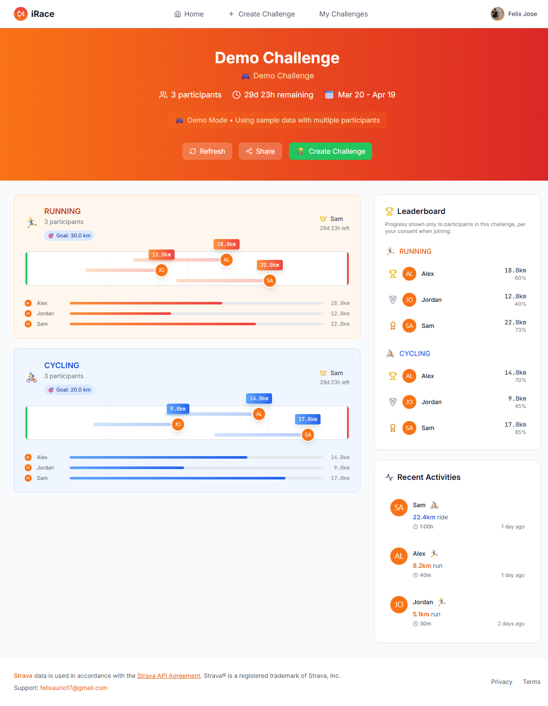 |

### Profile and Strava connection

| Connected | Not connected |
| --- | --- |
| 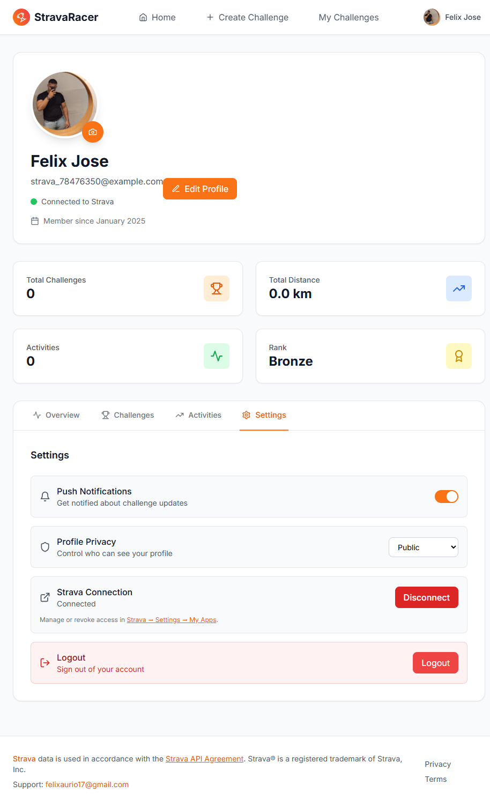 | 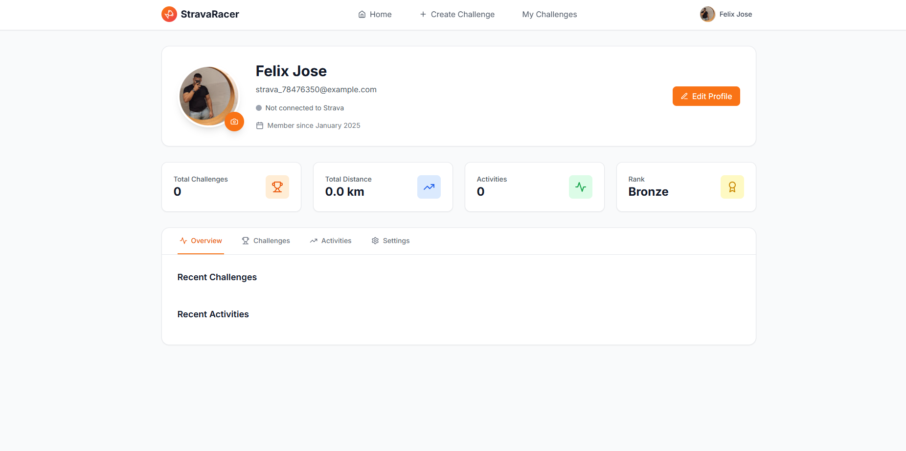 |

### Privacy and terms

| Privacy Policy | Terms |
| --- | --- |
| 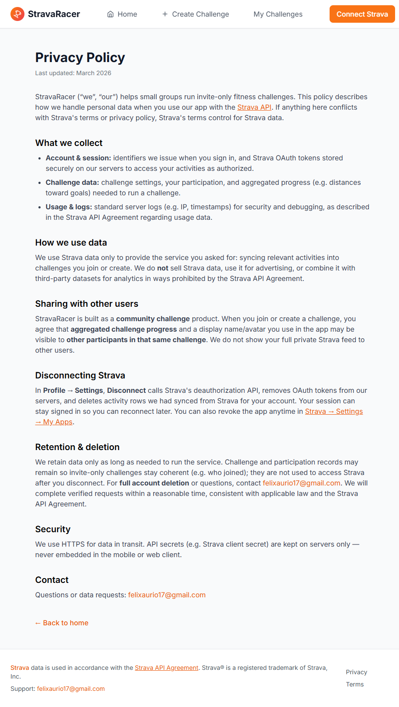 | 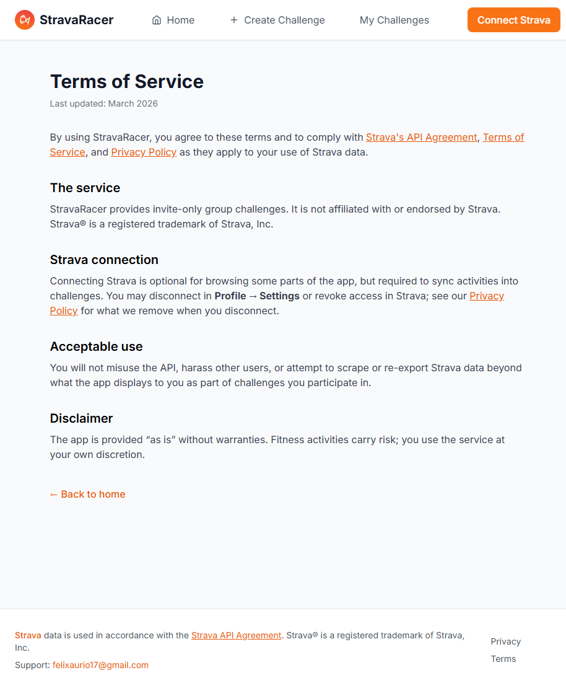 |

### Strava OAuth (on Strava)

After you choose **Connect Strava** in the app, Strava handles login and authorization:

| Strava login | Authorize app (scopes) |
| --- | --- |
| 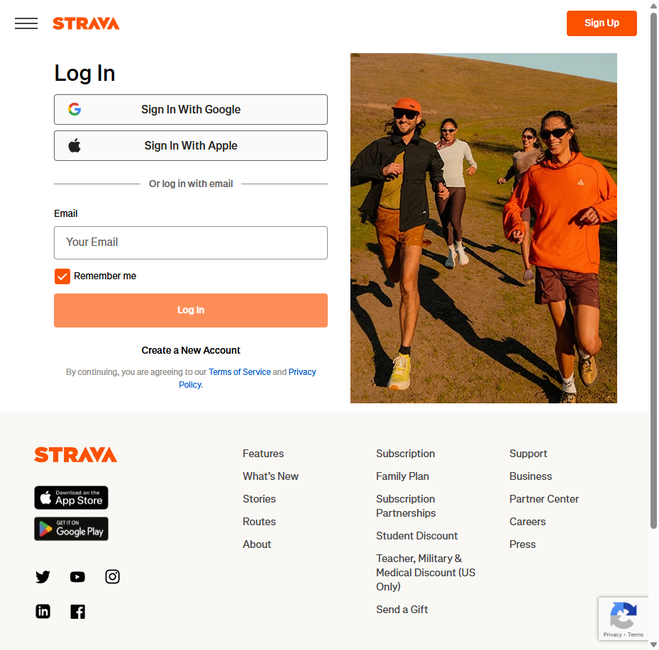 | 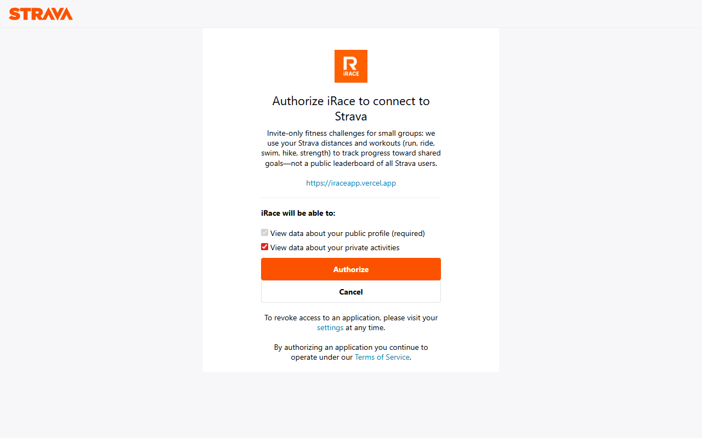 |

---

## Features

- Strava OAuth and activity-based progress for distance challenges
- Multi-sport challenges (running, cycling, swimming, and more)
- Shareable invite links; demo challenge for trying the UI without Strava
- Responsive UI (React, Tailwind, Framer Motion)
- PostgreSQL with Prisma for schema and app queries

## Tech stack

- **Frontend:** React 18, TypeScript, Vite, Tailwind CSS, Framer Motion
- **Auth:** Strava OAuth 2.0 (server-side token handling)
- **Data:** PostgreSQL, Prisma ([architecture notes](docs/ARCHITECTURE.md))
- **API:** Vercel serverless routes under `api/`

## Quick start

**Prerequisites:** Node.js 18+, npm, and a PostgreSQL instance (local or hosted).

```bash
git clone <your-repo-url>
cd irace   # or whatever your clone folder is named
npm install
```

Copy `.env.example` to `.env` / `.env.local` as needed. **Never expose `STRAVA_CLIENT_SECRET` in Vite** — keep it on the server only (e.g. Vercel).

**Browser (public):**

```env
VITE_STRAVA_CLIENT_ID=your_strava_client_id
VITE_SUPPORT_EMAIL=you@yourdomain.com
```

**Server:**

```env
STRAVA_CLIENT_ID=your_strava_client_id
STRAVA_CLIENT_SECRET=your_strava_client_secret
DATABASE_URL=postgresql://...
FRONTEND_URL=https://your-app.example.com
```

In [Strava API Settings](https://www.strava.com/settings/api), set the **Authorization Callback Domain** and redirect URI to match your app, e.g. `https://your-app.example.com/api/auth/strava/callback` (and the localhost equivalent for dev).

```bash
npm run dev
```

Open [http://localhost:5173](http://localhost:5173).

**TLS errors to Postgres or APIs:** use a proper `DATABASE_URL` (hosted providers usually document SSL). Do not disable certificate checks in production. For rare local setups only, see `ALLOW_INSECURE_TLS` in [`.env.example`](.env.example) and [`server/optionalInsecureTls.ts`](server/optionalInsecureTls.ts).

## Before you push

Run these locally and scan the diff before `git push`:

1. `npm run build` — Prisma client + Vite production build must succeed.
2. `npm run test` — Vitest unit tests (shared helpers + server utilities).
3. `npm run typecheck:api` — TypeScript check for `api/` (and `server/vercelQuery.ts`).
4. `npm run lint` — ESLint clean (or only known accepted warnings).
5. `git status` / `git diff` — no accidental files (`.env`, `.env.local`, `dist/`, editor junk).
6. Secrets — `STRAVA_CLIENT_SECRET`, DB passwords, VAPID private keys, webhook tokens must **not** appear in commits (use Vercel/env vars).
7. Strava app settings — production **callback URL** still matches your deploy (see [Quick start](#quick-start) above).
8. **Optional:** smoke the flows you changed (OAuth, join, race, webhook) on staging if you have it.

## Scripts

| Command | Description |
| --- | --- |
| `npm run dev` | Vite dev server |
| `npm run build` | `prisma generate` + production build |
| `npm run preview` | Preview production build |
| `npm run lint` | ESLint |
| `npm run typecheck:api` | `tsc` for `api/**/*.ts` |
| `npm run test` | Vitest (run once) |
| `npm run test:watch` | Vitest watch mode |

## Docker

Optional local stack (PostgreSQL and Redis) is defined in [`docker-compose.yml`](docker-compose.yml):

```bash
docker compose up -d
```

Adjust `DATABASE_URL` to point at the postgres service if you run the app against that database.

## Documentation

- [Architecture](docs/ARCHITECTURE.md) — data layer and conventions  
- Setup: [DATABASE_SETUP.md](docs/DATABASE_SETUP.md), [DEPLOY_INSTRUCTIONS.md](docs/DEPLOY_INSTRUCTIONS.md)  
- Strava: [STRAVA_WEBHOOK.md](docs/STRAVA_WEBHOOK.md), [STRAVA_SUBMISSION.md](docs/STRAVA_SUBMISSION.md)  
- Deployment: [VERCEL_DOMAIN.md](docs/VERCEL_DOMAIN.md), [DATABASE_VERCEL.md](docs/DATABASE_VERCEL.md)  
- Screenshot index: [docs/strava-submission-screenshots/README.md](docs/strava-submission-screenshots/README.md)

## Contributing

1. Fork and create a branch  
2. Make focused changes with clear commit messages  
3. Open a pull request  

## License

[MIT](LICENSE)
